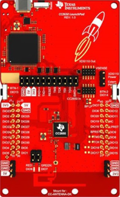

# TI-RTOS-CC2650-LaunchPad

This repository contains three programs that implement the TI-RTOS for task scheduling. All applications run under a SimpleLink Launchpad CC2650 Wireless MCU. The IDE used to program the Launchpad was Code Composer Studio as it supports TI's Microcontroller and Embedded Processors portfolio.

  

## Software

* Code Composer Studio v6.

## License

This project is licensed under the MIT License - see the [LICENSE.md](LICENSE.md) file for details.
